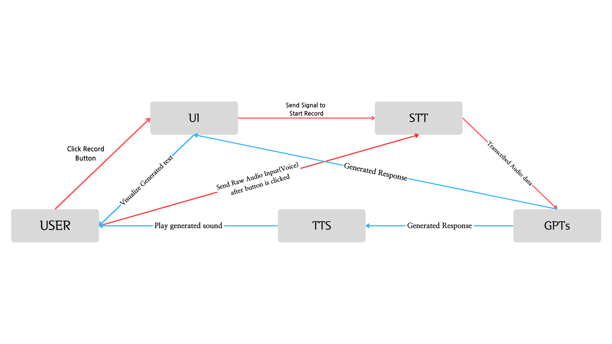

# Sidims Box - A Implementation between MS-iSTFT-VITS and GPTs, UI made with Unity.
Before actually downloading and try to use this, this project is SERVERLY based on my **OWN COMPUTER**, You would NOT want to run this without any adjustments.
This project isn't even finished yet, so don't use this entire project. It is not recommended.

## Project Structure

The project is made in two parts, UI and backend. the UI is fully made in unity, since the original Spine animation is not compatible with python.
The Backend is made with (obviously) python. The project's goal was to make the user and character impersonating GPTs to talk to each other. So the project needed a good TTS that could clone voices and a good STT service.
The STT is made with whisper, and I've used MB-iSTFT-VITS for the TTS part.
